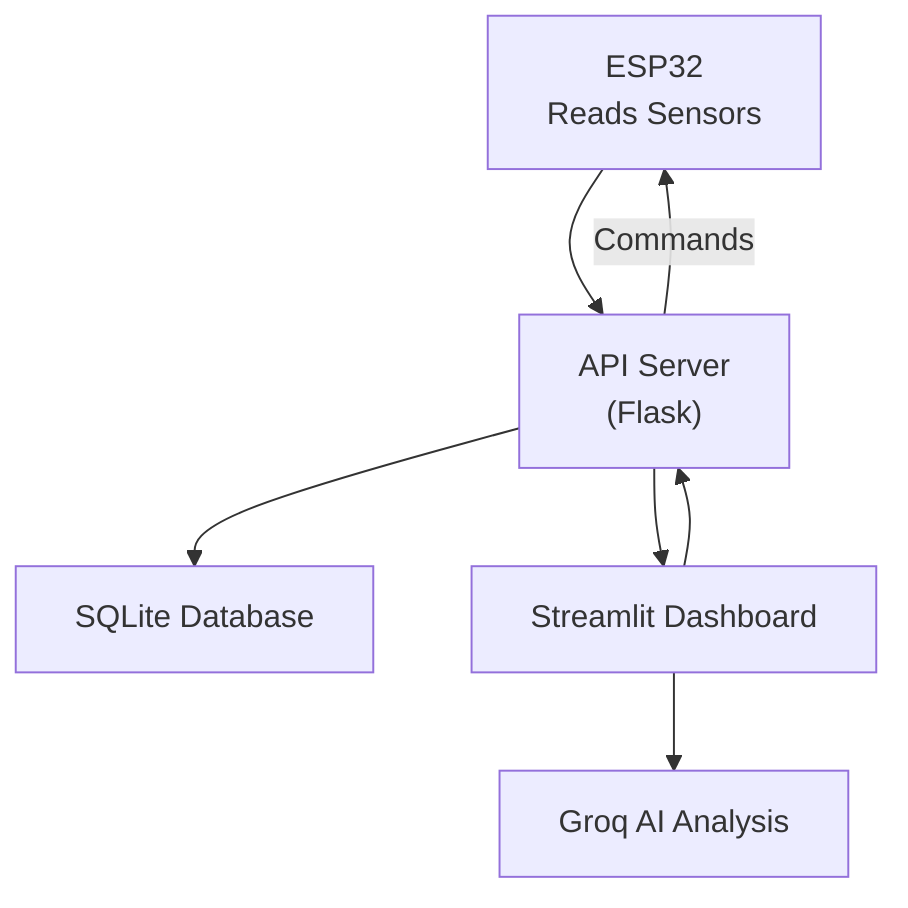

# Genset Monitoring System

A comprehensive IoT monitoring system for generator sets (gensets) using ESP32, Flask API, and a Streamlit dashboard with AI-powered analytics.

## 🚀 Features

### Core Monitoring
- **Real-time Sensor Data**: Temperature (LM75 I2C sensor) and fuel level (ultrasonic sensor)
- **Live Dashboard**: Streamlit interface with real-time updates from the API server
- **Alert System**: Configurable thresholds with buzzer notifications
- **Data Visualization**: Interactive charts and historical data
- **AI Analysis**: Groq API integration for intelligent insights

### ESP32 Integration
- **HTTP Communication**: RESTful API endpoints for data transmission
- **Buzzer & Relay Control**: Remote activation for alerts and control
- **WiFi Connectivity**: Automatic reconnection and status monitoring
- **Local Web Server**: Built-in web interface for local control and monitoring
- **OLED Display**: Real-time sensor data display
- **Sensor Support**: LM75 temperature sensor (I2C) and ultrasonic fuel level sensor

### API Server
- **Dedicated Endpoints**: Flask API server for ESP32 and dashboard communication
- **Data Storage**: SQLite database with automatic data logging
- **Health Monitoring**: System status and connectivity checks
- **CORS Support**: Cross-origin resource sharing for web integration

## 🗄️ Database System

### SQLite Database
- **Database File**: `logs/genset_data.db`
- **Type**: SQLite (file-based database)
- **Location**: `logs/` directory in project root

#### Database Schema
```sql
CREATE TABLE sensor_data (
    timestamp TEXT PRIMARY KEY,
    fuel_level REAL,
    temperature REAL
);
```

## 🔄 How the Project Works

### System Architecture
```
ESP32 Sensors → API Server (Flask) → SQLite Database → Streamlit Dashboard
```

### Communication Flow
1. **ESP32** reads sensors and sends JSON data to the API server via HTTP POST.
2. **API Server** receives and stores data in SQLite.
3. **Dashboard** fetches latest data from the API server and displays it live.
4. **Dashboard** can send relay/buzzer commands to the API server, which ESP32 fetches.

## 📁 Project Structure

```
genset_monitoring/
├── src/
│   ├── dashboard.py       # Streamlit dashboard
│   ├── api_server.py      # Flask API server
│   ├── config.py          # Configuration settings
│   ├── components/        # UI components
│   └── utils/             # Utility functions
├── ESP32_Genset_Monitor.ino  # ESP32 Arduino code
├── arduino_genset/
│   └── arduino_genset.ino # Arduino temperature sensor code
├── requirements.txt       # Python dependencies
├── logs/                  # Database and log files
│   └── genset_data.db     # SQLite database
└── data/                  # Additional data files
```

## 🛠️ Quick Start

### 1. Local Development Setup

```bash
# Clone the repository
git clone <repository-url>
cd genset_monitoring

# Create virtual environment
python -m venv venv
venv\Scripts\activate  # Windows
# source venv/bin/activate  # Linux/Mac

# Install dependencies
pip install -r requirements.txt

# Set environment variables (for AI)
# Do NOT commit secrets! Use .env or Streamlit/Render secrets
# Example .env:
GROQ_API_KEY=your_api_key_here
```

### 2. Database Initialization
- The SQLite database is created automatically at `logs/genset_data.db` on first run.

### 3. Start the API Server

```bash
python src/api_server.py
```
- The API server will be available at `http://localhost:5000`

### 4. Start the Dashboard

```bash
streamlit run src/dashboard.py
```
- The dashboard will be available at `http://localhost:8501`

### 5. Test the System

```bash
# Test API endpoints
curl http://localhost:5000/health

# Check database status
python src/check_db.py
```

## 🧠 System Technical Overview & Sensor Calibration

### ESP32 Firmware: How It Works
The ESP32 firmware (see `ESP32_Genset_Monitor.ino`) is responsible for:
- Reading temperature (LM75 I2C sensor) and fuel level (ultrasonic sensor)
- Displaying data on an OLED screen
- Serving a local web interface for status and control
- Sending sensor data to the API server via HTTP POST
- Fetching remote commands (relay/buzzer) from the API server
- Handling WiFi connectivity and automatic reconnection

#### Main Loop
- Reads sensors every 3 seconds
- Displays values on OLED
- Pushes data to the API server
- Fetches remote control commands
- Handles local web requests (for relay, buzzer, sensor data)

#### Endpoints Served by ESP32
- `/` — Status message
- `/relay/on` and `/relay/off` — Control relay
- `/sensors` — Get current sensor readings (JSON)
- `/notify` — Trigger buzzer alert

### Arduino Temperature Sensor Code
The `arduino_genset/arduino_genset.ino` file contains code for a frequency-based temperature sensor:
- Uses interrupt-capable digital pin to count pulses
- Calculates frequency and converts to temperature using calibration constants
- Outputs temperature data via Serial

### Sensor Calibration & Calculations

#### 1. Temperature (LM75 I2C Sensor)
- **Wiring:** LM75 sensor connected via I2C (SDA: GPIO21, SCL: GPIO22)
- **I2C Address:** 0x48 (default)
- **Reading:** 16-bit temperature value with 0.5°C resolution
- **Calculation:** 
  - Raw value is shifted right by 7 bits
  - Temperature = raw_value * 0.5°C
- **Calibration:** LM75 is factory calibrated, but verify readings against reference thermometer

#### 2. Fuel Level (Ultrasonic Sensor)
- **Wiring:** TRIG pin to GPIO12, ECHO pin to GPIO14
- **Measurement:**
  - Sends a 10μs pulse, measures echo return time
  - Converts time to distance:  
    `distance = duration * 0.034 / 2.0` (cm)
  - **Calibration:**
    - The code maps 10cm (full) to 40cm (empty):
      `fuelLevel = map(distance, 10, 40, 100, 0)`
    - Adjust 10 and 40 to match your tank's actual full/empty distances
    - The result is rounded to the nearest 5% for stability
    - If the sensor reads out of range, 0% is reported

#### 3. Buzzer & Relay
- **Buzzer:** Connected to GPIO26, used for alerts (e.g., on WiFi connect, remote notification)
- **Relay:** Connected to GPIO27, can be toggled locally (web) or remotely (API command)

### Data Flow & System Workflow



1. **ESP32** reads sensors, displays locally, and sends data to the API server.
2. **API Server** stores data, provides endpoints for dashboard and ESP32.
3. **Dashboard** fetches data, visualizes it, and can send control commands.
4. **AI Analysis** (Groq API) is triggered from the dashboard for advanced insights.
5. **Remote Control:** Dashboard can send relay/buzzer commands, which ESP32 fetches and executes.

### AI Analysis: How It Works
- The dashboard integrates with the Groq API for AI-powered analytics.
- **Capabilities:**
  - Detects anomalies and trends in temperature/fuel data
  - Predicts potential issues (e.g., overheating, low fuel)
  - Generates natural language summaries and recommendations
- **Workflow:**
  - User triggers analysis from the dashboard
  - Data is sent to Groq API
  - Results are displayed as insights, alerts, or recommendations

---

## 🔧 ESP32 Setup

### Hardware Requirements
- ESP32 development board
- LM75 temperature sensor (I2C)
- Ultrasonic sensor (HC-SR04 or similar)
- Buzzer for alerts
- Relay for control
- OLED display (SSD1306, 128x64)

### Software Setup
1. Install Arduino IDE
2. Add ESP32 board support
3. Install required libraries:
   - WiFi
   - HTTPClient
   - Wire (I2C)
   - Adafruit SSD1306 (for OLED)
   - Adafruit GFX (for OLED)

### Configuration
Update the ESP32 code with your WiFi and API server settings:

```cpp
const char* ssid = "YOUR_WIFI_SSID";
const char* password = "YOUR_WIFI_PASSWORD";

// Set to 1 for local, 0 for hosted
#define USE_LOCAL_API 0

#if USE_LOCAL_API
const char* api_server_url_data = "http://YOUR_LOCAL_IP:5000/api/sensor-data";
const char* api_server_url_cmds = "http://YOUR_LOCAL_IP:5000/api/commands";
#else
const char* api_server_url_data = "https://genset-monitoring.onrender.com/api/sensor-data";
const char* api_server_url_cmds = "https://genset-monitoring.onrender.com/api/commands";
#endif
```

### Hardware Connections
```
LM75 Temperature Sensor (I2C):
- VCC → 3.3V
- GND → GND
- SDA → GPIO21
- SCL → GPIO22

Ultrasonic Sensor:
- VCC → 3.3V
- GND → GND
- TRIG → GPIO12
- ECHO → GPIO14

OLED Display (SSD1306):
- VCC → 3.3V
- GND → GND
- SDA → GPIO21 (shared with LM75)
- SCL → GPIO22 (shared with LM75)

Buzzer:
- VCC → 3.3V
- GND → GND
- Signal → GPIO26

Relay:
- VCC → 3.3V
- GND → GND
- Signal → GPIO27
```

- **See the [System Technical Overview & Sensor Calibration](#system-technical-overview--sensor-calibration) section above for details on sensor wiring, calibration, and calculations.**

## 🌐 Deployment Options

### Local Deployment
- API Server: `http://localhost:5000`
- Dashboard: `http://localhost:8501`
- ESP32: Configure with local IP address

### Hosted Deployment
- API Server: e.g. `https://genset-monitoring.onrender.com`
- Dashboard: e.g. Streamlit Cloud or Render
- ESP32: Configure with public API server URL

See `DEPLOYMENT_GUIDE.md` for detailed instructions.

## 📊 API Endpoints

| Endpoint              | Method | Description                        |
|----------------------|--------|------------------------------------|
| `/health`            | GET    | Health check                       |
| `/api/sensor-data`   | POST/GET | Receive or fetch latest sensor data |
| `/api/buzzer`        | POST   | Control buzzer                     |
| `/api/relay`         | POST   | Control relay                      |
| `/api/commands`      | GET    | Get relay/buzzer commands for ESP32|
| `/api/status`        | GET    | Get system status                  |
| `/api/config`        | GET    | Get configuration                  |

### Example Usage

```bash
# Send sensor data
curl -X POST http://localhost:5000/api/sensor-data \
  -H "Content-Type: application/json" \
  -d '{"temperature": 25.5, "fuel_level": 75.2}'

# Fetch latest sensor data
curl http://localhost:5000/api/sensor-data

# Control buzzer
curl -X POST http://localhost:5000/api/buzzer -H "Content-Type: application/json" -d '{}'

# Control relay
curl -X POST http://localhost:5000/api/relay -H "Content-Type: application/json" -d '{"state": "on"}'

# Get ESP32 commands (relay/buzzer)
curl http://localhost:5000/api/commands
```

## 🔍 Monitoring Features

- **Live sensor status**: Temperature and fuel level
- **Alert system**: Visual and buzzer alerts
- **Data tables and charts**: Historical and real-time
- **AI insights**: Groq-powered analysis
- **Local web interface**: Direct control via ESP32 web server

## 🚨 Troubleshooting

### Common Issues

1. **ESP32 Connection Failed**
   - Check WiFi credentials and wiring
   - Verify API server URL is correct
   - Ensure API server is running and reachable

2. **API Server Issues**
   - Check if port 5000 is available
   - Verify Flask dependencies are installed
   - Check logs in `logs/api_server.log`

3. **Dashboard Problems**
   - Verify Streamlit is installed
   - Check API URL in sidebar
   - Ensure environment variables/secrets are set

4. **Database Issues**
   - Check if `logs/` directory exists
   - Verify SQLite file permissions
   - Run database health check: `python src/check_db.py`

5. **Sensor Issues**
   - **LM75:** Check I2C connections and address (default 0x48)
   - **Ultrasonic:** Verify TRIG/ECHO connections and power supply
   - **OLED:** Check I2C connections and address (default 0x3C)

### Debug Commands

```bash
# Test API server
curl http://localhost:5000/health

# View database contents (use dashboard or SQLite tools)
```

## 🔑 Secrets & Security
- **Never commit API keys or secrets to the repository.**
- Use `.env` (for local), Streamlit secrets, or Render environment variables for deployment.
- Add `.env` and `.streamlit/secrets.toml` to `.gitignore`.
- If a secret is accidentally committed, remove it from git history and rotate the key.

## 📈 Advanced Features

- **Groq AI integration**: Fast, intelligent analysis
- **Predictive analytics**: Trend prediction and anomaly detection
- **Smart alerts**: Intelligent alert recommendations
- **Data export**: CSV and JSON export capabilities
- **Local web control**: Direct access to ESP32 for local monitoring

---

**For full deployment and advanced configuration, see `DEPLOYMENT_GUIDE.md`.**

## Running the API Server

To start the API server, run this command from the project root:

```
python -m src.api_server
```

This ensures all imports work correctly. Do not run with 'python src/api_server.py' directly.

